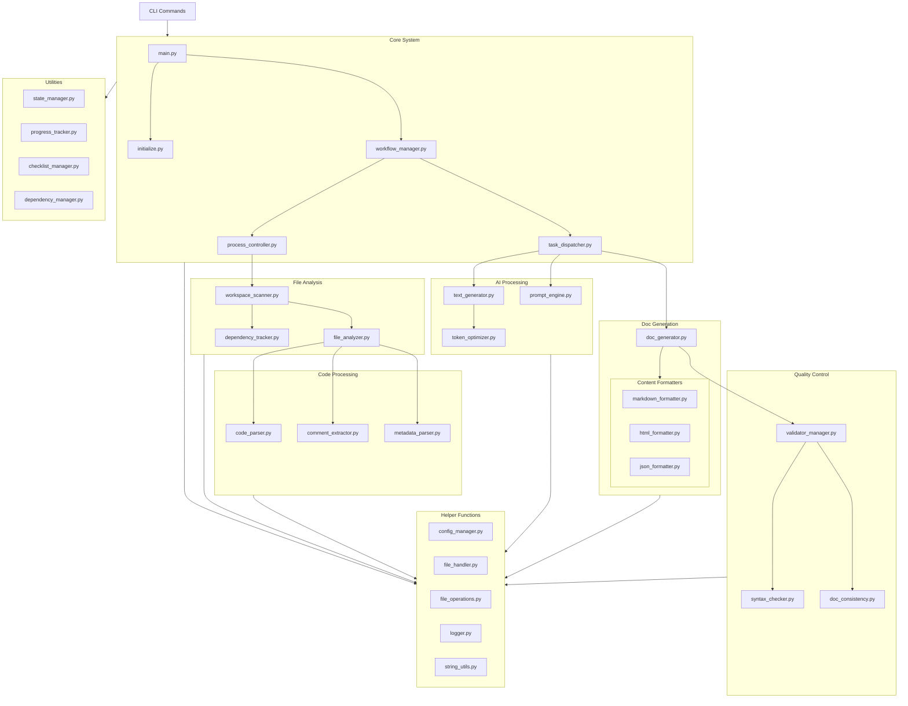

```mermaid

graph TD
    CLI[CLI Commands] --> Core
    subgraph Core[Core System]
        Main[main.py] --> Initialize[initialize.py]
        Main --> WorkflowManager[workflow_manager.py]
        WorkflowManager --> ProcessController[process_controller.py]
        WorkflowManager --> TaskDispatcher[task_dispatcher.py]
    end

    subgraph Scanners[File Analysis]
        ProcessController --> WorkspaceScanner[workspace_scanner.py]
        WorkspaceScanner --> FileAnalyzer[file_analyzer.py]
        WorkspaceScanner --> DependencyTracker[dependency_tracker.py]
    end

    subgraph Parsers[Code Processing]
        FileAnalyzer --> CodeParser[code_parser.py]
        FileAnalyzer --> CommentExtractor[comment_extractor.py]
        FileAnalyzer --> MetadataParser[metadata_parser.py]
    end

    subgraph AI[AI Processing]
        TaskDispatcher --> PromptEngine[prompt_engine.py]
        TaskDispatcher --> TextGenerator[text_generator.py]
        TextGenerator --> TokenOptimizer[token_optimizer.py]
    end

    subgraph Generators[Doc Generation]
        TaskDispatcher --> DocGenerator[doc_generator.py]
        DocGenerator --> Formatters
        subgraph Formatters[Content Formatters]
            MarkdownFormatter[markdown_formatter.py]
            HTMLFormatter[html_formatter.py]
            JSONFormatter[json_formatter.py]
        end
    end

    subgraph Validators[Quality Control]
        DocGenerator --> ValidatorManager[validator_manager.py]
        ValidatorManager --> SyntaxChecker[syntax_checker.py]
        ValidatorManager --> DocConsistency[doc_consistency.py]
    end

    subgraph Utils[Utilities]
        StateManager[state_manager.py]
        ProgressTracker[progress_tracker.py]
        ChecklistManager[checklist_manager.py]
        DependencyManager[dependency_manager.py]
    end

    subgraph Helpers[Helper Functions]
        ConfigManager[config_manager.py]
        FileHandler[file_handler.py]
        FileOperations[file_operations.py]
        Logger[logger.py]
        StringUtils[string_utils.py]
    end

    Core --> Utils
    Core --> Helpers
    Scanners --> Helpers
    Parsers --> Helpers
    AI --> Helpers
    Generators --> Helpers
    Validators --> Helpers

```
